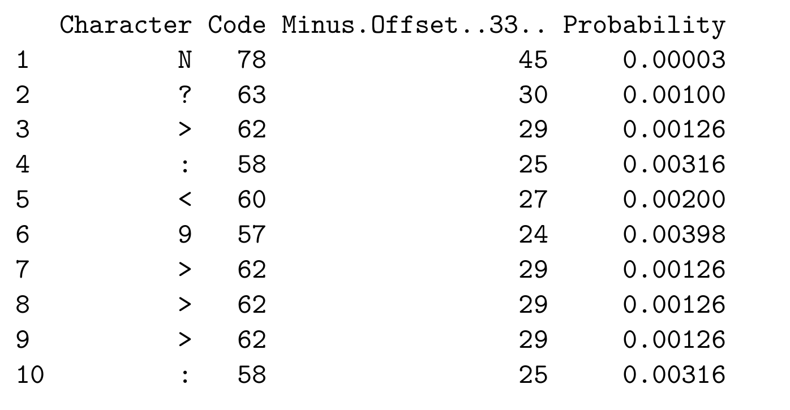
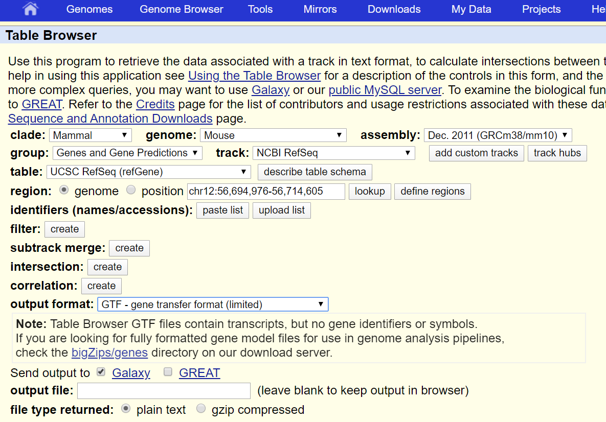
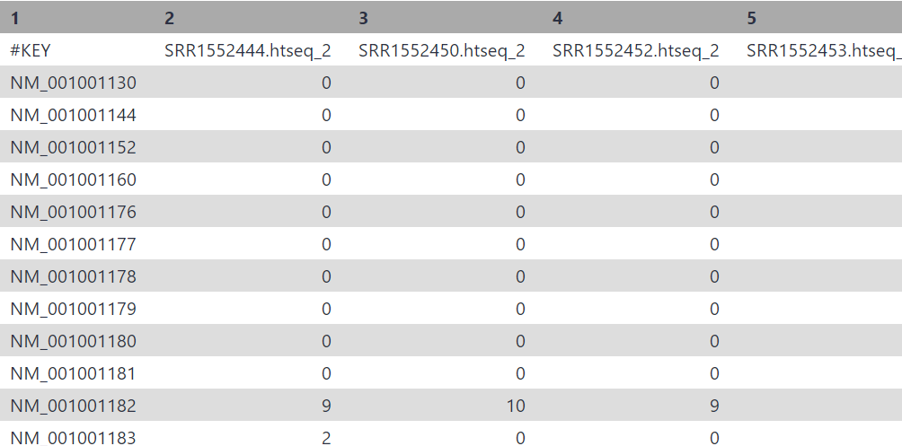
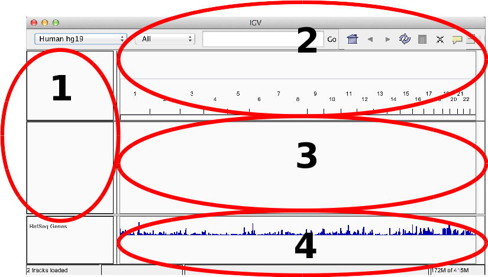

# Hands-on RNA-seq Analysis in Galaxy

## Acknowledgement

_Based on the RNA-Seq workshop by Melbourne Bioinformatics written by Mahtab Mirmomeni, Andrew Lonie, Jessica Chung_ [Original](http://vlsci.github.io/lscc_docs/tutorials/rna_seq_dge_advanced/rna_seq_advanced_tutorial/)

_Modified by David Powell (Monash Bioinformatics Platform)_

_Further Modified by Mark Dunning of Sheffield Bioinformatics Core_


### Sheffield Bioinformatics Core


web : [sbc.shef.ac.uk](https://sbc.shef.ac.uk)  
twitter: [@SheffBioinfCore](https://twitter.com/SheffBioinfCore)  
email: [bioinformatics-core@sheffield.ac.uk](bioinformatics-core@sheffield.ac.uk)

-----

## Tutorial Overview

This tutorial will cover the basics of RNA-seq using Galaxy; a open-source web-based platform for the analysis of biological data. You should gain an appreciation of the tasks involved in a typical RNA-seq analysis and be comfortable with the outputs generated by the Bioinformatician.

## Using these notes

<div class="exercise">
Sections with this background indicate exercises to be completed during the workshop.
</div>

<div class="information">
Sections with this background highlight particular shortcuts or other references that might be useful.
</div>

<div class="warning">
Sections with this background give information about potential error messages or might encounter, or problems that might arise in your own data analysis.
</div>

### More on Galaxy

The official Galaxy page has many [tutorials](https://galaxyproject.org/learn/) on using the service, and examples of other types of analysis that can be performed on the platform.

Those eventually wanted to perform their own RNA-seq analysis (for example in R), should look out for other courses

### Courses on analysing RNA-seq data in R

- [Sheffield Bioinformatics Core](https://sbc.shef.ac.uk/training/rna-seq-in-r-2020-02-13/)
- [Monash Bioinformatics Platform](http://monashbioinformaticsplatform.github.io/RNAseq-DE-analysis-with-R/)


## RNA-seq workflow


Workflow image from Ting-you Wang's [RNA-seq data analysis page](https://databeauty.com/blog/tutorial/2016/09/13/RNA-seq-analysis.html)

-----

## Background

#### Where do the data in this tutorial come from?
The data for this tutorial comes from a Nature Cell Biology paper, [*EGF-mediated induction of Mcl-1 at the switch to lactation is essential for alveolar cell survival*](http://www.ncbi.nlm.nih.gov/pubmed/25730472) [@Fu2015]. 

This study examines the expression profiles of basal stem-cell enriched cells (B) and committed luminal cells (L) in the mammary gland of virgin, pregnant and lactating mice. Six groups are present, with one for each combination of cell type and mouse status. Each group contains two biological replicates.

The full experimental design is as follows:-

Run  | Name | CellType | Status
------------- | ------------- | ------------- | -------------  
SRR1552444 | MCL1-LA | basal | virgin
SRR1552445 | MCL1-LB | luminal | virgin
SRR1552446 | MCL1-LC | Luminal | pregnancy
SRR1552447 | MCL1-LD | Luminal | pregnancy
SRR1552448 | MCL1-LE | luminal | lactation
SRR1552449 | MCL1-LF | luminal | lactation
SRR1552450 | MCL1-DG | basal | virgin
SRR1552451 | MCL1-DH | luminal | virgin
SRR1552452 | MCL1-DI | basal | pregnancy
SRR1552453 | MCL1-DJ | basal | pregnancy
SRR1552454 | MCL1-DK | basal | lactation
SRR1552455 | MCL1-DL | basal | lactation


For this tutorial, we will assume that the *wet-lab* stages of the experiment have been performed and we are now in the right-hand branch of the workflow. In this tutorial we will demonstrate the steps of **Quality assessment**, **alignment**, **quantification** and **differential expression testing**.

The *summarised* data for this experiment were made available on the Gene Expression Omnibus with accession [GSE60450](https://www.ncbi.nlm.nih.gov/geo/query/acc.cgi?acc=GSE60450), and full raw data can be obtained via the [SRA run browser](https://trace.ncbi.nlm.nih.gov/Traces/study/?acc=SRP045534&o=acc_s%3Aa). **For the purposes of this workshop we have created a downsampled dataset**

## Section 1: Preparation
#### 1. Sign-up to the European Galaxy server


- https://usegalaxy.eu
- The Australian server is an alternative if the European one is down:- https://usegalaxy.org.au/


**Make sure you check your email to activate your account**

#### 2. Download the course data

The data for this course have all been shared on a google drive. If you have not done so already, please download this directory as a zip file

https://drive.google.com/open?id=1ftuBP5L-rcXwsEub2mIaSDJ1tceHYFc7


#### 3.  Import the RNA-seq data for the workshop.

We can going to import the [*fastq* files](https://en.wikipedia.org/wiki/FASTQ_format) for this experiment. This is a standard format for storing raw sequencing reads and their associated quality scores. To make the practical quicker, we have *downsampled* the original fastq files to half a million reads.


<div class="information">

#### **Get Data -> Upload File ** 

</div>

You can import the data by:

1.  In the tool panel located on the left, under Basic Tools select **Get Data > Upload File**. Click on the **Choose local file** button on the
    bottom section of the pop-up window.
2.  Navigate to the `fastq` directory of the zip file that you downloaded from google drive and select these two files are from the basal-virgin condition. 

`SRR1552444.fastq.gz`
`SRR1552450.fastq.gz`
 
 and these two files are from the basal pregnant condition.

`SRR1552452.fastq.gz`
`SRR1552453.fastq.gz`


3.  You should now have these 4 files in your history:
    - `SRR1552444.fastq.gz`
    - `SRR1552450.fastq.gz`
    - `SRR1552452.fastq.gz`
    - `SRR1552453.fastq.gz`

<div class="information">
The `.gz` at the end of each file name means that it is *compressed* (like a zip file). 
</div>

### Combining lanes

<div class="warning">
In a sequencing experiment, the data for a particular sample might be spread across multiple *lanes*. For example, we might have files named `SRR1552444_L001.fastq.gz` and `SRR1552444_L002.fastq.gz` indicating that the reads for the sample `SRR1552444` are containing in two separate files. If so, the two fastq.gz files will need to be combined. The `fastq.gz` files will need to be decompressed on your machine first (the [7zip tool](https://www.7-zip.org/download.html) can do this on Windows) and then uploaded as fastq. The *Concatentate Datasets* tool can then be used to combine the files for each sample.

</div>

### Uploading large files

<div class="warning">
Galaxy recommend that large datasets (Gbs of data) are uploaded using *FTP*. Instructions for doing this can be found here:-

https://galaxyproject.org/ftp-upload/

**N.B. If you are using the European server, replace `usegalaxy.org` with `usegalaxy.eu` when following the instructions**

You will need an FTP program such as [*filezilla*](https://filezilla-project.org/), which has a free download. 


</div>

### Understanding fastq format

Each read is described by 4 lines in the file:-


The quality scores are [ASCII](http://ascii-code.com/) representations of how confident we are that a particular base has been called correctly. Letters that are further along the alphabet indicate higher confidence. This is important when trying to identify types of genome variation such as single base changes, but is also indicative of the overall quality of the sequencing. Different scales have been employed over time (resulting in a different set of characters appearing in the file). We will need to tell Galaxy which scale has been used in order that we can process the data correctly.


### Deriving the Quality Score

First of all, we convert the base-calling probability (p) into a `Q` score using the formula

- Quality scores $$ Q = -10log_{10}p$$
    + Q = 30, p=0.001
    + Q = 20, p=0.01
    + Q = 10, p=0.1
- These numeric quanties are *encoded* as [**ASCII**](http://ascii-code.com/) code
    + At least 33 to get to meaningful characters
    (https://en.wikipedia.org/wiki/FASTQ_format)
    
      

### Quality Scores to probabilities

- look-up the ASCII code for each character
- subtract the offset to get the Q score
- convert to a probability using the formula:-

$$ p = 10^{-Q/10} $$



In practice, we don't have to convert the values as we have software that will do this automatically


-----

## Section 2: Quality assessment with FastQC

[FastQC](https://www.bioinformatics.babraham.ac.uk/projects/fastqc/) is a popular tool from [Babraham Institute Bioinformatics Group](https://www.bioinformatics.babraham.ac.uk/index.html) used for *quality assessment* of sequencing data. Most Bioinformatics pipelines will use FastQC, or similar tools in the first stage of the analysis. The [documentation](https://www.bioinformatics.babraham.ac.uk/projects/fastqc/Help/) for FastQC will help you to interpret the plots and stats produced by the tool. A traffic light system is used to alert the user's attention to possible issues. However, it is worth bearing in mind that the tool is blind to the particular type of sequencing you are performing (i.e. whole-genome, ChIP-seq, RNA-seq), so some warnings might be expected due to the nature of your experiment.

<div class="information">

#### *FastQ Quality Control* -> *FastQC Read Quality reports*

</div>

**Make sure you select this tool. There is another version of FastQC present, which does not produce some of the output we need for a later step**

- Select one of the FASTQ files as input and *Execute* the tool.
- When the tool finishes running, you should have an HTML file in your History. Click on the eye icon to view the various quality metrics.
- Run Fastqc on the remaing fastq files, but don't examine the results just yet.


<div class="exercise">

**Question: Do the data seem to be of reasonable quality? **

You can use the [documentation](https://www.bioinformatics.babraham.ac.uk/projects/fastqc/Help/3%20Analysis%20Modules/) to help interpret the plots

</div>

If poor quality reads towards the ends of reads are considered to be a problem, or there is considerable adapter contamination, we can employ various tools to *trim* our data.

However, a recent paper demonstrated that read trimming is no longer required prior to alignment:- https://www.biorxiv.org/content/10.1101/833962v1

<div class="warning">

If you suspect contamination from adapter sequence or unacceptable quality scores towards the ends of reads various trimming options are supported by the *Trimmomatic* tool (amongst others)

#### *FASTA/FASTQ* -> *Trimmomatic*

The operations supported by trimmomatic will probably not be very informative on our example data (as it has already been processed), but you can try several operations if you get time:-

- Removing Illumina adapter sequences by setting *Perform initial ILLUMINACLIP* to *Yes* and selecting the appropriate adapter type
- Remove poor quality bases at the end of reads by choosing *Cut bases off the end of a read, if below a threshold quality (TRAILING)* under *Select Trimmomatic operation to perform*
- Remove poor quality bases at the start of reads by choosing *Cut bases off the start of a read, if below a threshold quality (LEADING)* under *Select Trimmomatic operation to perform*
- You can apply multiple operations in turn by clicking *Insert Trimmomatic Operation*

</div>

<div class="warning">

If you also suspect contamination by another organism, or rRNA present in your data, you can use the sortMeRNA tool to remove this artefact.
</div>


## Combining QC reports

It can be quite tiresome to click through multiple QC reports and compare the results for different samples. It is useful to have all the QC plots on the same page so that we can more easily spot trends in the data.

The [multiqc](https://multiqc.info/) tool has been designed for the tasks of aggregating qc reports and combining into a single report that is easy to digest.


<div class="information">

*FASTQ Quality Control* -> *Multiqc*

</div>

Under *Which tool was used generate logs?* Choose *fastqc* and select the RawData output from the fastqc run on each of your bam files.


<div class="exercise">

Question: Repeat the FastQC analysis for the remaining fastq files and combine the reports with `multiQC`. Do the fastq files seem to have consistently high-quality?
</div>


## Section 3: Alignment

In this section we map the reads in our FASTQ files to a reference genome. As
these reads originate from mRNA, we expect some of them will cross exon/intron
boundaries when we align them to the reference genome. `HISAT2` is a splice-aware
mapper for RNA-seq reads that is based on Bowtie. It uses the mapping results
from Bowtie to identify splice junctions between exons. More information on
HISAT2 can be found [here](https://ccb.jhu.edu/software/hisat2/index.shtml).


<div class="information">

Mapping -> HISAT2

</div>


#### 1.  Map/align the reads with HISAT2 to the mm10 reference genome
In the left tool panel menu, under NGS Analysis, select
**Mapping > HISAT2** and set the parameters as follows:  

- **Is this single-end or paired-end data?** Single-end (as individual datasets)  
- **FASTQ file**  
(Click on the multiple datasets icon and select all four of the
FASTQ files)
    - `SRR1552444.fastq.gz`
    - `SRR1552450.fastq.gz`
    - `SRR1552452.fastq.gz`
    - `SRR1552453.fastq.gz`

- **Source for the reference genome** Use
built-in genome
- **Select a reference genome:** Mouse (Mus Musculus): mm10
- Use defaults for the other fields
- Execute


Note: This may take a few minutes, depending on how busy the server is.


#### 2.  Rename the output files
You should have 4 output files; one for each of the FASTQ input files:

`HISAT2 on data.. aligned reads (BAM)`

It will be helpful to rename these to something shorter for the next steps.

- `SRR1552444.bam`
- `SRR1552450.bam`
- `SRR1552452.bam`
- `SRR1552453.bam`

<div class="warning">

If this step is taking too long, there is an aligned bam file present in the google drive link. You can use this in the following steps of the tutorial.

</div>

<div class="information">

*STAR* is also another popular option for aligned RNA-seq reads. We won't cover this today, or the relative merits of different methods. If you want to try STAR in your own time you can find it under.


<div class="alert alert-info">

Mapping -> RNA STAR

</div>

## About the aligned read format

Unlike most of Bioinfomatics, a *single standard* file format has emerged for aligned reads. Moreoever, this file format is consistent regardless of whether you have DNA-seq, RNA-seq, ChIP-seq... data. 


The first part of the header lists the names (`SN`) of the sequences (chromosomes) used in alignment, their length (`LN`). Sometimes,  a *md5sum* "[digital fingerprint](https://en.wikipedia.org/wiki/Md5sum)" of the `.fasta` file used for alignment (`M5`) is shown.

```
@HD VN:1.0 SO:coordinate
@SQ SN:chr1 LN:195471971
@SQ SN:chr10 LN:130694993
@SQ SN:chr11 LN:122082543
.....
.....

```

If mutliple samples were present in the file (i.e. the samples have been *multiplexed*), *read groups* can be used to identify which sequencing library, sequencing centre, Lane, sample name etc.

(**not present for the example data in this course**)

```
@RG	ID:SRR077850	CN:bi	LB:Solexa-42057	PL:illumina	PU:ILLUMINA	SM:NA06984
@RG	ID:SRR081675	CN:bi	LB:Solexa-42316	PL:illumina	PU:ILLUMINA	SM:NA06984
@RG	ID:SRR080818	CN:bi	LB:Solexa-44770	PL:illumina	PU:ILLUMINA	SM:NA06984
@RG	ID:SRR084838	CN:bi	LB:Solexa-42316	PL:illumina	PU:ILLUMINA	SM:NA06984
@RG	ID:SRR081730	CN:bi	LB:Solexa-42316	PL:illumina	PU:ILLUMINA	SM:NA06984
.....
.....

```

Finally, we have a section where we can record the processing steps used to derive the file. This is 
```
@PG ID:hisat2 PN:hisat2 VN:2.1.0 CL:"/mnt/pulsar/dependencies/_conda/envs/mulled-v1-e7321ba46fa5ea4c6b9a06b78e6cd5182b33c0a47c2c86b5d610e1361f8b1686/bin/hisat2-align-s --wrapper basic-0 -p 4 -x /cvmfs/data.galaxyproject.org/managed/hisat2_index/mm10/mm10 -U /tmp/16282.unp"
....
....

```

Next is a *tab-delimited* section that describes the alignment of each sequence in detail. 

```
SRR1552450.220289	0	chr1	3200839	60	100M	*	0	0	GGCTCACCAAGTATGATGGTTTCATACCCAGAAAAACATTTGTTCTTTTGGATGCCATTAGTTCAGCCAGTGTCAACATGACTAGTGGTTTCCCAAGCAC	CCCFFFFDHHGDHGIIJJJIHGHGGIGHIIIGFHGHBIIHIJAGIJIJJGGCHJJIGIJJJGHCAGGHHIICGGHHHHHHFFFFFDCE;?AACCDCDDDC	AS:i:0 XN:i:0 XM:i:0 XO:i:0 XG:i:0 NM:i:0 MD:Z:100 YT:Z:UU NH:i:1
SRR1552450.138797	16	chr1	3201132	60	100M	*	0	0	CATTTTTAACAGCATATTTGTCTTAGCTTTAAATCCAGAGTACTGTTTGGCTTCAAAGAAGATAGTCATCTCTGGTTCTCTTACTGAGAATAGAAAGTCT	DDEEEEEEEFFFFFFFHHHHHIIGCHGEJJJJJJJJJJIJJJJJJJJJJJJIJIJJJJJJJJJJJJIGJJJJJIJJJJJJJIHJJJJHHHHHFFFFFCCC	AS:i:0 XN:i:0 XM:i:0 XO:i:0 XG:i:0 NM:i:0 MD:Z:100 YT:Z:UU NH:i:1

```

The first 11 columns of each line have an official specification

Column | Official Name | Brief
------ | -------------- | -----------
1      | QNAME          | Sequence ID
2      | FLAG           | Sequence quality expressed as a bitwise flag
3      | RNAME          | Chromosome
4      | POS            | Start Position
5      | MAPQ           | Mapping Quality
6      | CIGAR          | Describes positions of matches, insertions, deletions w.r.t reference
7      | RNEXT          | Ref. name of mate / next read
8      | PNEXT          | Postion of mate / next read
9      | TLEN           | Observed Template length
10     | SEQ            | Sequence
11     | QUAL           | Base Qualities

There can also be all manner of optional tags as extra columns introduce by an aligner or downstream analysis tool. A common use is the `RG` tag which refers back to the read groups in the header.


### Quality Control Flags

The *"flags"* in the sam file can represent useful QC information

  + Read is unmapped
  + Read is paired / unpaired
  + Read failed QC
  + Read is a PCR duplicate (see later)

The combination of any of these properties is used to derive a numeric value. For instance, a particular read might have a flag of 163

### Derivation

There is a set of properties that a read can possess. If a particular property is observed, a corresponding power of 2 is added multiplied by 1. The final value is derived by summing all the powers of 2.


```
 	ReadHasProperty 	Binary 	MultiplyBy
isPaired 	TRUE 	1 	1
isProperPair 	TRUE 	1 	2
isUnmappedQuery 	FALSE 	0 	4
hasUnmappedMate 	FALSE 	0 	8
isMinusStrand 	FALSE 	0 	16
isMateMinusStrand 	TRUE 	1 	32
isFirstMateRead 	FALSE 	0 	64
isSecondMateRead 	TRUE 	1 	128
isSecondaryAlignment 	FALSE 	0 	256
isNotPassingQualityControls 	FALSE 	0 	512
isDuplicate 	FALSE 	0 	1024

```
Value of flag is given by 
```
1x1 + 1x2 + 0x4 + 0x8 + 0x16 + 1x32 + 0x64 + 1x128 + 0x256 + 0x512 + 0x1024 = 163
```

See also

- https://broadinstitute.github.io/picard/explain-flags.html

### Have a CIGAR!


The ***CIGAR*** (**C**ompact **I**diosyncratic **G**apped **Alignment** **R**eport) string is a way of encoding the match between a given sequence and the position it has been assigned in the genome. It is comprised by a series of letters and numbers to indicate how many consecutive bases have that mapping.


 
 Code  | Description
------------- | -------------
M  | alignment match
I  | insertion
D  | deletion
N  | skipped
S  | soft-clipping
H  | hard-clipping


e.g.

- `101M`
    + 101 bases matching the reference
- `1S100M`
    + 1 soft-clipped read followed by 100 matches
- `15M87N70M90N16M`
    + 15 matches following by 87 bases skipped followed by 70 matches etc.

### `sam` or `bam?`

Alignment algorithms such as `HISAT2` tend to produce a `sam` file as their raw output, whereas we usually analyse a `.bam` file. The contents of both files are *exactly the same*. Whereas a `sam` file is designed to be *human-readable*, a `bam` file can be processed *more efficiently by a computer* as it is compressed and indexed. 

The reads in a `sam` file tend to be arranged in the order that they were generated by the sequencer. On the other hand, the `bam` file that you see in Galaxy has been sorted according to the position that the reads map. If you run your own alignments using command line software, you will need to use a tool to *sort and index* the data before analysis.

-----

## Quality assessment of the aligned reads

*samtools* will calculate QC statistics for a set of aligned reads in *bam* format

<div class="information">
*SAM/BAM -> Samtools stats*
</div>

If you view the output you will see that it is not very easy to interpret. 
<div class="information">
*FASTQ Quality Control* -> *Multiqc*

make sure **Which tool was used to generate logs** is set to **Samtools** and select the Samtools stats.... files that were produced in the previous step
</div>


## Section 4. Quantification (Counting reads in features)

In order to test for differential expression, we need to count up how many times each "feature" is observed in each sample. The goal of such operations is to produce a *count table* such as that shown below. We can then apply statistical tests to these data


HTSeq-count creates a count matrix using the number of the reads from each bam
file that map to the genomic features. For each feature (a
gene for example) a count matrix shows how many reads were mapped to this
feature.

Various rules can be used to assign counts to features


To obtain the coordinates of each gene, we can use the UCSC genome browser which is integrated into Galaxy.

### Obtaining gene coordinates


<div class="information">

**Get Data** -> **UCSC Main** table browser

</div>




Selecting the **UCSC Main** tool from Galaxy will take you to the UCSC table browser. From here we can extract gene coordinates for our genome of interest (`mm10`) in `gtf` format for processing with galaxy.

- Set *clade* to **Mammal**
- Set *genome* to **Mouse**
- *assembly* **Dec.2011 (GRCm38/mm10)**
- *group* **Genes and Gene Prediction**
- *track* **NCBI RefSeq**
- *table* **UCSC RefSeq (refGene)**
- *region* **genome**
- *output format* **GTF - gene transfer format (limited)** and *send output to* **Galaxy**

Click *get output* and *send query to Galaxy* to be returned to Galaxy. A new job will be submitted to retrieve the coordinates from UCSC


<div class="information">
**RNA Analysis > htseq-count**
</div>

1.  Use HTSeq-count to count the number of reads for each feature.  
    In the left tool panel menu, under NGS Analysis, select
    **NGS Analysis > htseq-count** and set the parameters as follows:  
    - **Aligned SAM/BAM file**  
      (Select one of four bam files, or all four using the multiple datasets option)
    - **GFF file** UCSC Main on Mouse:ncbiRefSeq (genome)
    - Use defaults for the other fields
    - Execute
2.  Repeat for the remaining bam files if running on each bam separately.
3.  To make things easier to track, rename the ht-seq output for each sample to contain the corresponding sample name (e.g. SRR1552444.htseq). **Do not rename the outputs that have "(no feature)" in their name**

<div class="warning">

When you are returned to Galaxy from UCSC it might look like you have lost all th files in your analysis and are no longer logged in. 

To solve this, log back in and choose the **View all histories** option under the History panel.


There should be two "histories"; one containing all the outputs you generated before accessing UCSC, and one containing the UCSC output. All this point you can switch back to your previous history, and drag the box containing the UCSC ouput to this history


</div>


### Further QC on the aligned reads

Additional QC of the aligned reads can be obtained with the Qualimap tool. This also uses information from the genome transcript file to calculate how many reads are counted in exonic, intronic and intergenic regions. For RNA-seq this percentage should be *high*; at least 80 to 90%.

<div class="information">
**RNA-Seq > Qualimap RNA-Seq QC**
</div>

### Create a count matrix

The htseq tool is designed to produce a separate table of counts for each sample. This is not particularly useful for other tools such as Degust (see next section) which require the counts to be presented in a data matrix where each row is a gene and each column is a particular sample in the dataset.

<div class="information">
*Collection Operations -> Column Join* on Collections
</div>

- In the *Tabular Files* section, select the `ht-seq` count files from your history *SRR1552444.htseq*, *SRR1552450*, etc... Holding the CTRL key allows multiple files to be selected
- Keep *Identifier column* as `1`

The output should look something like this...


- Download to your computer


**You are now ready to follow the next tutorial on [Differential Expression](02-differential-expression.nb.html)**

## Adding extra annotation to results

The count matrix has *RefSeq ID* in the first column, but no other useful annotation. Sometimes we might want other IDs to be added in order to interpret our results. Individual queries can be made online (e.g. Ensembl, biomart) but tedious for large numbers of genes. The Galaxy tool **annotateMyIDs** is a simple tool for annotating a file containing a column of IDs.

<div class="information">
**Annotation** -> **annotateMyIDs**
</div>

- File with IDs: *Column Join on Data...*
- Organism: Mouse
- ID Type: RefSeq
- Keep all other defaults

This should produce an output table containing the original ID, and the equivlent Gene Symbol, Ensembl ID.

The output can then be *joined* to the original results file to produce a more detailed result

<div class="information">
**Text Manipulation** -> **Join two files**
</div>

- 1st file: *Column Join on data....*
- Column to use from 1st file: Column 1
- 2nd file: result from *annotateMyIDs on data...*
- Column to use from 2nd file: Column 1

<div class="alert alert-info">
The step of annotating your results may need modifying (or may not be necessary) depending on what IDs you have used in the counting. Make sure you choose the options carefully when using this tool.
</div>

# Exercise before the next session

<div class="exercise">

In the folder you downloaded from google drive, you have the fastq files for all other samples in the dataset. Repeat the workflow steps for these remaining files

- QC with fastQC
- Alignment against the mm10 genome with HiSat2
- Counting with htseq

Create a combined QC report and combined count matrix **for all samples**.

</div>

# Optional

<font size="4">***We will not go through the following section in the workshop, but feel free to work through in your own time***</font>

# (Optional) Assessing Differential Expression with *DESeq2*

There are several sensible and respected choices for performing a differential expression analysis on RNA-seq data. Here, we  will illustrate the `DESeq2` method because it is readily available through Galaxy. 

<div class="information">

**NGS: RNA Analysis > DESeq2**
</div>

In the Galaxy tool panel, under NGS Analysis, select
**NGS: RNA Analysis > DESeq2** and set the parameters as follows:


- **1. Factor level** Virgin
- **Count files**  
    - `SRR1552444.htseq`
    - `SRR1552450.htseq`
- **2. Factor level:** Pregnant
- **Select columns containing control:**  
    - `SRR1552452.htseq`
    - `SRR1552453.htseq`
- For **Output normalized counts table** select **Yes**
- Execute

#### 2.  Examine the outputs from the previous step
1.  Examine the `DeSeq2 result file`by
    clicking on the **eye icon**.
    This file is a list of genes sorted by p-value from using DESeq2 to
    perform differential expression analysis.
2.  Examine the `DeSeq2 plots` file. This file has some
    plots from running DESeq2, including [PCA](http://setosa.io/ev/principal-component-analysis/) and clustering.
    

`DESeq2` reports, for each gene that is being tested, some information that we can use to determine if the gene is different between our conditions of interest. We will do more exploration of differential expression analysis in the next section using a tool that is not included in Galaxy. For now we will concentrate on the task on finding out which genes have *sufficient statistical evidence* for being differentially expressed between our two conditions.


## (Opional) Visualise the aligned reads with IGV

Download the bam files you have created in the previous step by clicking the disk icon on the right-hand panel. Make sure to click both the **Download dataset** and **Download index** buttons. We will now visualise the alignments using the Integrative Genomics Viewer (IGV).


### Introducing the IGV Browser


Whilst tools like R are very powerful and allow you to perform statistical analyses and test hypotheses, there is no substitute for ***looking at the data***. A trained-eye can quite quickly get a sense of the data quality before any computational analyses have been run. Futhermore, as the person requesting the sequencing, you probably know a lot about the biological context of the samples and what to expect. 

- IGV has been developed by the Broad Institute and is able to display most kinds of genomic data
    + expression
    + ChIP
    + whole-genome resequencing
    + shRNA
- It is a *Java* desktop application and can be run either locally of from the Broad website
- To run IGV yourself you will need to agree to the license and [download the version for your OS](http://www.broadinstitute.org/software/igv/download)

<div class="warning">
If you have problems running IGV, you may need to download an updated version of Java

https://java.com/download

</div>

### A quick tour of IGV
For more details

- Full set of slides from [MRC Clinical Sciences Centre](http://mrccsc.github.io/IGV_course/igv.html#/)
- IGV tutorial from the [Griffth lab - WashU](https://github.com/griffithlab/rnaseq_tutorial/wiki/IGV-Tutorial)



1) Sample information panel
    - Information about samples you have loaded
    - e.g. Sample ID, Gender, Age, Tumour / Normal
    
2) Genome Navigation panel
    - Jump to a genomic region in `Chr:Start-End` format
    - Jump to a gene symbol of interest
    
3) Data panel
    - Your sequencing reads will be displayed here
    - Or whatever data you have loaded
        + see information on [accepted file formats](http://www.broadinstitute.org/software/igv/RecommendedFileFormats)

4) Attribute panel
    - Gene locations
    - Genome sequence (if zoomed-in at appropriate level)
    - Proteins
    
### Example

Go to ***File*** -> ***Load from file*** and select the aligned `bam` files from `HISAT2`. Note that the index files `.bai` need to be present in the same directory. However, you only need to click on the `.bam`

<div class="alert alert-info">
Make sure that the genome selected is `mm10`. The default wil be human hg19
</div>

- The black dotted vertical lines indicates the centre of the view
- Each of the grey pointed rectangles represents a sequencing reads
    + whether the pointed bit is on the left or right indicates if the read is forward or reverse.
- A coverage track is also generated
- You should see the read that we described in detail in the previous section by *hover*ing over the reads to display the information from the `.bam` file

The view in IGV is not static and we can scroll-along the genome by holding-down the left mouse in the data panel and dragging left and right

It's worth noting that the display settings may be showing fewer reads than you have (*downsampling*) in order to conserve memory. Also, some QC-fail or PCR duplicates may be filtered.

We also have some options on how to display the reads themselves, which we can acccess by right-clicking on the bam track

Sorting alignments by:-

  - start
  - strand
  - base
  - mapping quality
  - insert size
  
The reads themselves can also be coloured according to

  - insert size
  - read strand
  - sample

