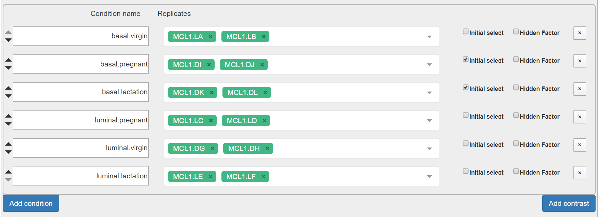

# Hands-on RNA-seq Analysis in Galaxy

## Acknowledgement

_Based on the RNA-Seq workshop by Melbourne Bioinformatics written by Mahtab Mirmomeni, Andrew Lonie, Jessica Chung_ [Original](http://vlsci.github.io/lscc_docs/tutorials/rna_seq_dge_advanced/rna_seq_advanced_tutorial/)

_Modified by David Powell (Monash Bioinformatics Platform)_

_Further Modified by Mark Dunning of Sheffield Bioinformatics Core_

The Degust part of this session is based on the tutorial [Differential gene expression using Galaxy and Degust](http://sepsis-omics.github.io/tutorials/modules/dge/) from Antibiotic Resistant Pathogens Initiative (ARPI)

### Sheffield Bioinformatics Core

web : [sbc.shef.ac.uk](https://sbc.shef.ac.uk)  
twitter: [@SheffBioinfCore](https://twitter.com/SheffBioinfCore)  
email: [bioinformatics-core@sheffield.ac.uk](bioinformatics-core@sheffield.ac.uk)

-----

## Tutorial Overview

This tutorial will cover the basics of RNA-seq using Galaxy; a open-source web-based platform for the analysis of biological data. You should gain an appreciation of the tasks involved in a typical RNA-seq analysis and be comfortable with the outputs generated by the Bioinformatician.

### More on Galaxy

The official Galaxy page has many [tutorials](https://galaxyproject.org/learn/) on using the service, and examples of other types of analysis that can be performed on the platform.

Those eventually wanted to perform their own RNA-seq analysis (for example in R), should look out for other courses

### Courses on analysing RNA-seq data in R

- [Sheffield Bioinformatics Core](http://sbc.shef.ac.uk/training/rna-seq-in-r-2019-01-14/)
- [Monash Bioinformatics Platform](http://monashbioinformaticsplatform.github.io/RNAseq-DE-analysis-with-R/)

## Recap

Previous sections have illustrated how to

- [perform quality assessment on our fastq files](01-pre-processing.nb.html#section_2:_quality_assessment_with_fastqc)
- [align fastq files to the reference genome](01-pre-processing.nb.html#section_3:_alignment)
- [visualise the reads in IGV](01-pre-processing.nb.html#section_4_visualise_the_aligned_reads_with_igv)
- [count against a set of reference transcripts](01-pre-processing.nb.html#section_5_quantification_(counting_reads_in_features))

We will now use the published counts as the input for a differential expression analysis.

## Differential expression

The term *differential expression* was first used to refer to the process of finding statistically significant genes from a *microarray* gene expression study.

Such methods were developed on the premise that microarray expression values are approximately *normally-distributed* when appropriately transformed (e.g. by using a log$_2$ transformation) so that a modified version of the standard *t-test* can be used. The same test is applied to each gene under investigation yielding a *test statistic*, *fold-change* and *p-value*. Similar methods have been adapted to RNA-seq data to account for the fact that the data are *count-based* and do not follow a normal distribution.

## Interactive exploration of the results with *DEGUST*

[http://degust.erc.monash.edu/](http://degust.erc.monash.edu/)

`Degust` is a web tool that can analyse the counts files produced in the step above, to test for differential gene expression. It offers and interactive view of the differential expression results

The input file is a count matrix where each row is a measured gene, and each column is a different biological sample. Within the tool we can configure which samples belong to the different biological groups of interest.

Read counts have to be normalised first prior to differential expression testing. There are two main biases that need to be accounted for:-

- size of gene
    + *longer* genes will have more reads assigned to them
- library size
    + a sample that is sequenced to a higher depth will receive more reads
  
However, R-based methods such as `edgeR` (implented in Degust) and `DESeq2` have their own method of normalising counts. You will probably encounter other methods of normalising RNA-seq reads such as *RPKM*, *CPM*, *TPM* etc. [This blog](https://www.rna-seqblog.com/rpkm-fpkm-and-tpm-clearly-explained/) provides a nice explanation of the current thinking. As part of the `Degust` output, you have the option of downloading normalised counts in various formats. Some other online visualisation tools require normalised counts as input, so it is good to have these to-hand.

***To make this a more-realistic example, we will use the published count matrix for this dataset. This was downloaded from the Gene Expression Omnibus (GEO) under the accession number [GSE60450](https://www.ncbi.nlm.nih.gov/geo/query/acc.cgi?acc=GSE60450). Note that we have shortened the column headings to help with visualisation***

Download the counts from [this link](GSE60450_Lactation-GenewiseCounts_rename.txt)

### Uploading the count matrix to Degust

N.B. Degust claims to accept a *csv* (comma-separated) file, but is in fact happy with a tabular file like the one we have just created.

- From the main degust page, click *Upload your counts file*
- Click on Browse
- Select the location of the file `GSE60450_Lactation-GenewiseCounts_rename.txt`, and click *Open*.
- Click *Upload*
- A Configuation page will appear.

- For Name type "*GSE60450*" (or whatever you want to call the analysis)
- For Info columns select *EntrezGeneID* and *Length* 
- Click Add condition
    + Refering to the experiment design (below), select the Basal samples and call the condition Basal
    + Repeat for the Luminal samples
- Save the settings and then View the results

Run  | Name | CellType | Status
------------- | ------------- | ------------- | -------------  
SRR1552444 | MCL1-LA | basal | virgin
SRR1552445 | MCL1-LB | luminal | virgin
SRR1552446 | MCL1-LC | Luminal | pregnancy
SRR1552447 | MCL1-LD | Luminal | pregnancy
SRR1552448 | MCL1-LE | luminal | lactation
SRR1552449 | MCL1-LF | luminal | lactation
SRR1552450 | MCL1-DG | basal | virgin
SRR1552451 | MCL1-DH | luminal | virgin
SRR1552452 | MCL1-DI | basal | pregnancy
SRR1552453 | MCL1-DJ | basal | pregnancy
SRR1552454 | MCL1-DK | basal | lactation
SRR1552455 | MCL1-DL | basal | lactation

## Overview of Degust sections

- Top black panel with Configure settings at right.
- Left: Conditions: Control and Treatment.
- Left: Method selection for DGE. **Select edgeR for your method**
- Top centre: Plots, with options at right.
- When either of the expression plots are selected, a heatmap appears below.
- A table of genes (or features); expression in treatment relative to control (Treatment column); and significance (FDR column).

(screenshot from the example at ARPI)

## MDS plot

This is a multidimensional scaling plot which represents the variation between samples. It is a similar concept to a Principal Components Analysis (PCA) plot. The x-axis is the dimension with the highest magnitude. In a standard control/treatment setup, samples should be split along this axis. A desirable plot is shown below:-

## MA-plot

Each dot shows the change in expression in one gene.

- The average expression (over both condition and treatment samples) is represented on the x-axis.
    + Plot points should be symmetrical around the x-axis.
    + We can see that many genes are expressed at a low level, and some are highly expressed.
- The fold change is represented on the y axis.
    + If expression is significantly different between batch and chem, the dots are red. If not, they are blue. (In Degust, significant means FDR <0.05).
    + At low levels of gene expression (low values of the x axis), fold changes are less likely to be significant.

Click on the dot to see the gene name.

## Parallel coordinates and heatmap

Each line shows the change in expression in one gene, between control and treatment.

- Go to Options at the right.
    + For FDR cut-off set at 0.001.
    + This is a significance level (an adjusted p value). We will set it quite low in this example, to ensure we only examine key differences.
- Look at the Parallel Coordinates plot. There are two axes:
    + Left: Control: Gene expression in the control samples. All values are set at zero.
    + Right: Treatment Gene expression in the treatment samples, relative to expression in the control.
- The blocks of blue and red underneath the plot are called a heatmap.
    + Each block is a gene. Click on a block to see its line in the plot above.
    + Look at the row for the chem. Relative to batch, genes expressed more are red; genes expressed less are blue.

## Table of genes

Table of genes

- gene_id: names of genes. Note that gene names are sometimes specific to a species, or they may be only named as a locus ID (a chromosomal location specified in the genome annotation).
- FDR: False Discovery Rate. This is an adjusted p value to show the significance of the difference in gene expression between two conditions. Click on column headings to sort. By default, this table is sorted by FDR.
- basal and luminal: log2(Fold Change) of gene expression. The default display is of fold change in the treatment relative to the control. Therefore, values in the batch column are zero. This can be changed in the Options panel at the top right.
    + In some cases, a large fold change will be meaningful but in others, even a small fold change can be important biologically.

The table can be sorted according to any of the columns (e.g. fold-change or p-value)

## Download and R code

Above the genes table is the option to download the results of the current analysis to a csv file. You can also download the *R* code required to reproduce the analysis by clicking the *Show R code* box underneath the Options box.

**Question:** How many genes are differentially-expressed in this analysis? Is this lower than you would expect? Look more closely at the MDS and QC plots. 

**Question:** Having identified the problem with the analysis, modify the configuration and repeat. How many genes are differentially expressed this time?

# Analysing a different contrast

Comparing Basal vs Luminal wasn't really the main question of interest in the dataset, but it serves to illustrate the importance of checking QC plots. 

- Create conditions *Basal.Pregnant*, *Basal.Lactation*, etc using the corrected experimental design
- Make sure that *Basal.Pregnant* and *Basal.Lactation* are both ticked as initial select

Take some time to understand the various parts of the report

**Question:** Make sure the FDR cut-off and abs LogFC cutoffs are set to default and *download* the file and rename to `background.tsv`. We will use this later.

**Question**: How many genes are differentially-expressed with an FDR < 0.05 and abs logFC > 1. Download this file and rename it to `B.preg_vs_lactation.tsv`.

**Question**: Repeat the analysis for Luminal.Pregnant vs Luminal.Lactation and download the table of differentially-expressed results (same FDR and log fold-change). 

## Overlapping Gene Lists

We might sometimes want to compare the lists of genes that we identify using different methods, or genes identified from more than one contrast. In our example dataset we can compare the genes in the contrast of pregnant vs luminal in basal and luminal cells

The website *venny* provides a really nice interface for doing this.

- Open both your *Basal Pregnant vs Basal Lactation* and *Luminal Pregnant vs Luminal Lactation* results files in Excel
- Go to the venny website
    + http://bioinfogp.cnb.csic.es/tools/venny/
- Copy the names of genes with adjusted p-value less than 0.05 in the Basal analysis into the **List 1** box on the venny website. **List 1** can be renamed to *Basal*
- Copy the names of genes with adjusted p-value less than 0.05 in the Luminal analysis into the **List 2** box on the venny website. **List 2** can be renamed to **Luminal**
- venny should now report the number of genes found in each list, the size of the intersection, and genes unique to each method
- clicking on a particular overlap part of the venn diagram to display the list of genes common to both cell types. Paste this list of genes into a new Excel worksheet and save as a file `gene_overlap.csv`.

You are now ready to complete the file section on [annotation and enrichment analysis](03-enrichment.nb.html)

 
 

