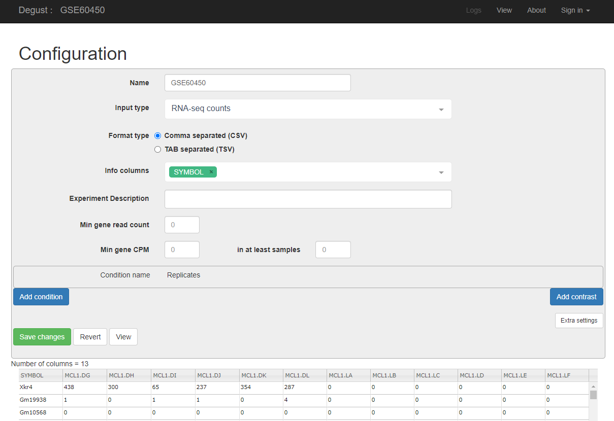

# Hands-on RNA-seq Analysis in Galaxy

## Acknowledgement

_Based on the RNA-Seq workshop by Melbourne Bioinformatics written by Mahtab Mirmomeni, Andrew Lonie, Jessica Chung_ [Original](http://vlsci.github.io/lscc_docs/tutorials/rna_seq_dge_advanced/rna_seq_advanced_tutorial/)

_Modified by David Powell (Monash Bioinformatics Platform)_

_Further Modified by Mark Dunning of Sheffield Bioinformatics Core_

The Degust part of this session is based on the tutorial [Differential gene expression using Galaxy and Degust](http://sepsis-omics.github.io/tutorials/modules/dge/) from Antibiotic Resistant Pathogens Initiative (ARPI)

### Sheffield Bioinformatics Core

web : [sbc.shef.ac.uk](https://sbc.shef.ac.uk)  
twitter: [@SheffBioinfCore](https://twitter.com/SheffBioinfCore)  
email: [bioinformatics-core@sheffield.ac.uk](bioinformatics-core@sheffield.ac.uk)

-----

## Tutorial Overview

This tutorial will cover the basics of RNA-seq using Galaxy; a open-source web-based platform for the analysis of biological data. You should gain an appreciation of the tasks involved in a typical RNA-seq analysis and be comfortable with the outputs generated by the Bioinformatician.

### More on Galaxy

The official Galaxy page has many [tutorials](https://galaxyproject.org/learn/) on using the service, and examples of other types of analysis that can be performed on the platform.

Those eventually wanted to perform their own RNA-seq analysis (for example in R), should look out for other courses

### Courses on analysing RNA-seq data in R

- [Sheffield Bioinformatics Core](http://sbc.shef.ac.uk/training/rna-seq-in-r-2019-01-14/)
- [Monash Bioinformatics Platform](http://monashbioinformaticsplatform.github.io/RNAseq-DE-analysis-with-R/)

## Recap

Previous sections have illustrated how to

- [perform quality assessment on our fastq files](01-pre-processing.nb.html#section_2:_quality_assessment_with_fastqc)
- [align fastq files to the reference genome](01-pre-processing.nb.html#section_3:_alignment)
- [visualise the reads in IGV](01-pre-processing.nb.html#section_4_visualise_the_aligned_reads_with_igv)
- [count against a set of reference transcripts](01-pre-processing.nb.html#section_5_quantification_(counting_reads_in_features))

We will now use the counts as the input for a differential expression analysis. **We will use two different methods for assessing differential expression; one implemented in Galaxy, and one implemented in an interactive web tool. We will then compare the results. In practice, you only need use one of these methods. Both should perform equally well**.

## Differential expression

The term *differential expression* was first used to refer to the process of finding statistically significant genes from a *microarray* gene expression study.

Such methods were developed on the premise that microarray expression values are approximately *normally-distributed* when appropriately transformed (e.g. by using a log$_2$ transformation) so that a modified version of the standard *t-test* can be used. The same test is applied to each gene under investigation yielding a *test statistic*, *fold-change* and *p-value*. Similar methods have been adapted to RNA-seq data to account for the fact that the data are *count-based* and do not follow a normal distribution.

## Interactive exploration of the results with *DEGUST*

[http://degust.erc.monash.edu/](http://degust.erc.monash.edu/)

`Degust` is a web tool that can analyse the counts files produced in the step above, to test for differential gene expression. It offers and interactive view of the differential expression results

The input file is a count matrix where each row is a measured gene, and each column is a different biological sample. Within the tool we can configure which samples belong to the different biological groups of interest.

### Create a count matrix

The htseq tool is designed to produce a separate table of counts for each sample. This is not particularly useful for other tools such as Degust which require the counts to be presented in a data matrix where each row is a gene and each column is a particular sample in the dataset.

*Collection Operations -> Column Join* on Collections

- In the *Tabular Files* section, select the `ht-seq` count files from your history *batch1.htseq*, *batch2.htseq*, etc... Holding the CTRL key allows multiple files to be selected
- Keep *Identifier column* as `1`

The output should look something like this...

- Download to your computer

### Uploading the count matrix to Degust

N.B. Degust claims to accept a *csv* (comma-separated) file, but is in fact happy with a tabular file like the one we have just created.

- From the main degust page, click *Upload your counts file*
- Click on Browse
- Select the file containing the *count matrix* that you previously downloaded to your computer from Galaxy, and click *Open*.
- Click *Upload*
- A Configuation page will appear.

- For Name type "*DGE in SaCer3*" (or whatever you want to call the analysis)
- For Info columns select "#KEY"
- For Analyze server side leave box checked.
- Click Add condition
    + Add a condition called “Batch” and select the `batch` columns.
    + Add a condition called “Chem” and select the `chem` columns.
- Save the settings and then View the results

## Overview of Degust sections
- Top black panel with Configure settings at right.
- Left: Conditions: Control and Treatment.
- Left: Method selection for DGE. **Select edgeR for your method**
- Top centre: Plots, with options at right.
- When either of the expression plots are selected, a heatmap appears below.
- A table of genes (or features); expression in treatment relative to control (Treatment column); and significance (FDR column).

(screenshot from the example at ARPI)

## MDS plot

This is a multidimensional scaling plot which represents the variation between samples.
Ideally:
- All the batch samples would be close to each other
- All the chem samples would be close to each other
- The batch and chem groups would be far apart

The x-axis is the dimension with the highest magnitude. The control/treatment samples should be split along this axis.

Here, our batch samples are on the left and the chem samples are on the right, which means they are well separated on their major MDS dimension, which looks correct. It is important to retain as much metadata about the samples as possible (e.g. batch, date of sequencing, gender, age etc). This can help diagnose situations when the first dimension is not associated with your main contrast of interest.

## MA-plot

Each dot shows the change in expression in one gene.

- The average expression (over both condition and treatment samples) is represented on the x-axis.
    + Plot points should be symmetrical around the x-axis.
    + We can see that many genes are expressed at a low level, and some are highly expressed.
- The fold change is represented on the y axis.
    + If expression is significantly different between batch and chem, the dots are red. If not, they are blue. (In Degust, significant means FDR <0.05).
    + At low levels of gene expression (low values of the x axis), fold changes are less likely to be significant.

Click on the dot to see the gene name.

## Parallel coordinates and heatmap

Each line shows the change in expression in one gene, between control and treatment.

- Go to Options at the right.
    + For FDR cut-off set at 0.001.
    + This is a significance level (an adjusted p value). We will set it quite low in this example, to ensure we only examine key differences.
- Look at the Parallel Coordinates plot. There are two axes:
    + Left: Control: Gene expression in the control samples. All values are set at zero.
    + Right: Treatment Gene expression in the treatment samples, relative to expression in the control.
- The blocks of blue and red underneath the plot are called a heatmap.
    + Each block is a gene. Click on a block to see its line in the plot above.
    + Look at the row for the chem. Relative to batch, genes expressed more are red; genes expressed less are blue.

## Table of genes

Table of genes

- gene_id: names of genes. Note that gene names are sometimes specific to a species, or they may be only named as a locus ID (a chromosomal location specified in the genome annotation).
- FDR: False Discovery Rate. This is an adjusted p value to show the significance of the difference in gene expression between two conditions. Click on column headings to sort. By default, this table is sorted by FDR.
- batch and chem: log2(Fold Change) of gene expression. The default display is of fold change in the treatment relative to the control. Therefore, values in the batch column are zero. This can be changed in the Options panel at the top right.
    + In some cases, a large fold change will be meaningful but in others, even a small fold change can be important biologically.

The table can be sorted according to any of the columns (e.g. fold-change or p-value)

## Download and R code

Above the genes table is the option to download the results of the current analysis to a csv file. You can also download the *R* code required to reproduce the analysis by clicking the *Show R code* box underneath the Options box.

# Practice on larger dataset (breast cancer)

We are going to use some more realistic data to practice running a differential expression analysis. In the next section we will use these same results to perform a gene set enrichment and pathways analysis.

The data are from the The Cancer Genome Atlas (TCGA) project and comprise the RNA-seq counts from 5 breast cancer patients and 5 healthy individuals.

The data for this exercise can be downloaded using [this link](https://raw.githubusercontent.com/sheffield-bioinformatics-core/rna-seq-in-galaxy/gh-pages/tcga_raw_counts.csv)

**Question**: Upload the file `tcga_raw_counts,csv` to degust and perform a differential expression analysis

**Make sure that edgeR is selected as the Method to perform the analysis**

Take some time to understand the various parts of the report

**Question:** Check out the results for genes `C4orf7` and `SULT1C3`. You should find that both have extreme fold-change values, but are not particularly significant. Why do you think this might be?

Download the Degust results file as a **tsv** file. You will need to click the down arrow next to *Download csv* to change the output type from csv to tsv (tab-separated).

You are now ready to complete the file section on [pathways and enrichment analysis](03-enrichment.nb.html)

 
 

***We will not go through the following section in the workshop, but feel free to work through in your own time***

# (Optional) Assessing Differential Expression with *DESeq2*

There are several sensible and respected choices for performing a differential expression analysis on RNA-seq data. Here, we  will illustrate the `DESeq2` method because it is readily available through Galaxy. 

**NGS: RNA Analysis > DESeq2**

[DESeq2](https://bioconductor.org/packages/release/bioc/html/DESeq2.html)
is an R package, that is used for analysing differential expression of RNA-Seq data and can either use exact statistical methods or generalised 
linear models.

`DESeq2` takes an input the counts that we generated in the previous step. Reads counts have to be normalised first prior to differential expression testing. There are two main biases that need to be accounted for:-

- size of gene
    + *longer* genes will have more reads assigned to them
- library size
    + a sample that is sequenced to a higher depth will receive more reads
  
`DESeq2` has its' own method of normalising counts. You will probably encounter other methods of normalising RNA-seq reads such as *RPKM*, *CPM*, *TPM* etc. [This blog](https://www.rna-seqblog.com/rpkm-fpkm-and-tpm-clearly-explained/) provides a nice explanation of the current thinking. As part of the `DESeq` output, you have the option of downloading normalised counts in various formats. Some other online visualisation tools require normalised counts as input, so it is good to have these to-hand.

In the Galaxy tool panel, under NGS Analysis, select
**NGS: RNA Analysis > DESeq2** and set the parameters as follows:

- **1. Factor level** Batch
- **Count files**  
    - `batch1-htseq`
    - `batch2-htseq`
- **2. Factor level:** Chem
- **Select columns containing control:**  
    - `chem1-htseq`
    - `chem2-htseq`
- For **Output normalized counts table** select **Yes**
- Execute

#### 2.  Examine the outputs from the previous step
1.  Examine the `DeSeq2 result file`by
    clicking on the **eye icon**.
    This file is a list of genes sorted by p-value from using DESeq2 to
    perform differential expression analysis.
2.  Examine the `DeSeq2 plots` file. This file has some
    plots from running DESeq2, including [PCA](http://setosa.io/ev/principal-component-analysis/) and clustering.
    

`DESeq2` reports, for each gene that is being tested, some information that we can use to determine if the gene is different between our conditions of interest. We will do more exploration of differential expression analysis in the next section using a tool that is not included in Galaxy. For now we will concentrate on the task on finding out which genes have *sufficient statistical evidence* for being differentially expressed between our two conditions.

#### 3.  Extract the significant differentially expressed genes.  
Under Basic Tools, click on **Filter and Sort > Filter**:

- **Filter:** `DESeq2 results file`
- **With following condition:** `c7 < 0.05 and (c3 > 1.0 or c3 < -1.0)`
- **Number of header lines to skip:** 1
- Execute

This will keep the genes that have an adjusted p-value (column 7 in the table) of less
or equal to 0.05 and have a fold change of greater than 1 or less than -1. There should be 20 genes in this file.
Rename this file by clicking on the **pencil icon** of and change the name
from "Filter on data x" to `DESeq2_Significant_DE_Genes`

Question: 

Why do you think it is important to use the *adjusted* p-value to select which genes are differentially-expressed. Why might you also want to specify a fold-change cutoff? Discuss with your neighbours

## Overlapping Gene Lists

We might sometimes want to compare the lists of genes that we identify using different methods, or genes identified from more than one contrast. In our example dataset we have one contrast (batch vs chem), but we can however compare genes identified by DESeq2 and Degust (voom).

The website *venny* provides a really nice interface for doing this.

- Open both your DESeq2 and Degust results files in Excel
- Go to the venny website
    + http://bioinfogp.cnb.csic.es/tools/venny/
- Copy the names of genes with adjusted p-value less than 0.05 in the DESeq2 analysis into the top-left box on the venny website
- Copy the names of genes with adjusted p-value less than 0.05 in the Degust analysis into the rop-right box on the venny website
- venny should now report the number of genes found in each list, the size of the intersection, and genes unique to each method
- clicking on a particular part of the venn diagram to display the list of genes

## References

[1] Nookaew I, Papini M, Pornputtpong N, Scalcinati G, Fagerberg L, Uhlén M, Nielsen J: A comprehensive comparison of RNA-Seq-based transcriptome analysis from reads to differential gene expression and cross-comparison with microarrays: a case study in Saccharomyces cerevisiae. Nucleic Acids Res 2012, 40 (20):10084 – 10097. doi:10.1093/nar/gks804. Epub 2012 Sep 10

[2] Guirguis A, Slape C, Failla L, Saw J, Tremblay C, Powell D, Rossello F, Wei A, Strasser A, Curtis D: PUMA promotes apoptosis of hematopoietic progenitors driving leukemic progression in a mouse model of myelodysplasia. Cell Death Differ. 2016 Jun;23(6)
