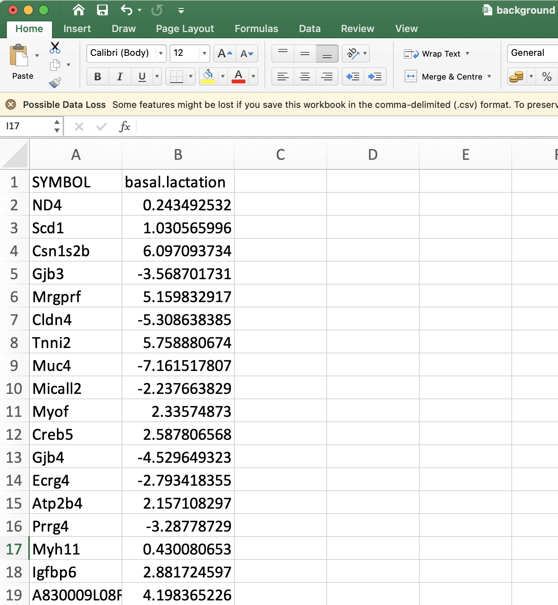
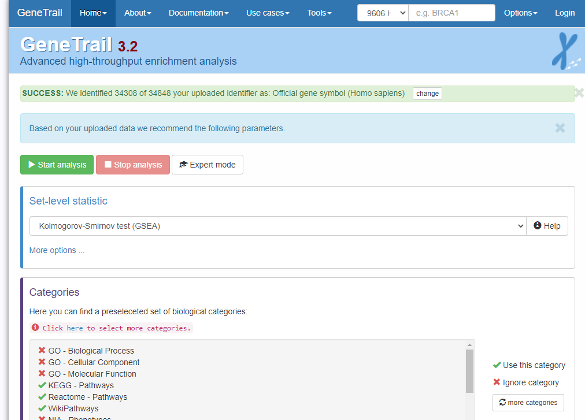
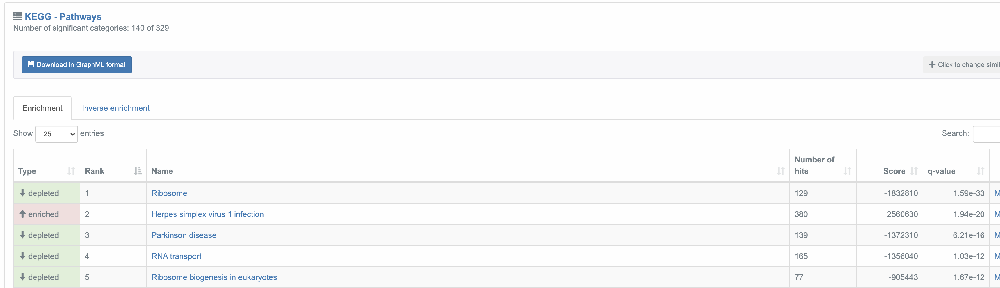
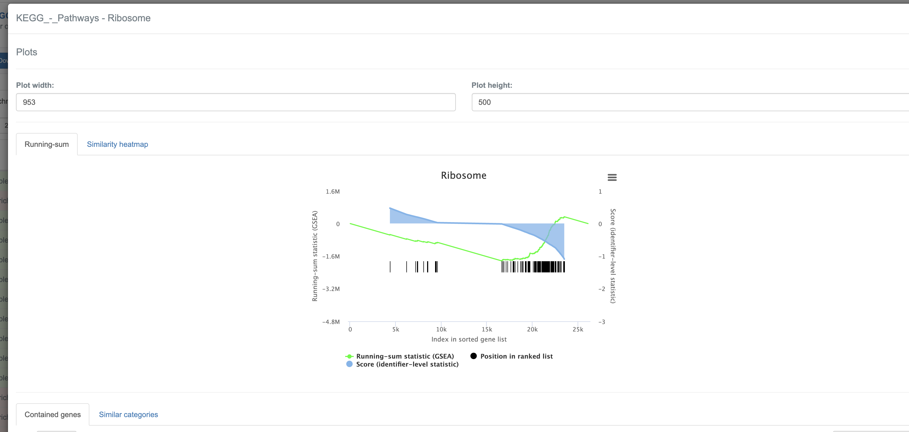

```{r setup, include=FALSE}
knitr::opts_chunk$set(echo = FALSE)
```


```{r echo=FALSE,message=FALSE}
library(limma)
```

# Recap

In this section we will use the following files

- [`background.csv`](background.csv) containing one row for each gene in the comparison Basal.pregnant vs Basal.lactation (27,179 rows).
- [`B.preg_vs_lactation.csv`](B.preg_vs_lactation.csv) containing one row for each found to be DE in the contrast Basal.pregnant vs Basal.Lactation.

It will be helpful to have both these files open in Excel.

# Gene-Ontologies and Annotation


In the early days of microarray analysis, people were happy if they got a handful of differentially-expressed genes that they could validate or follow-up. However, with later technologies (and depending on the experimental setup) we might have thousands of statistically-significant results, which no-one has the time to follow-up. Also, we might be interested in pathways / mechanisms that are altered and not just individual genes.

In this section we move towards discovering if our results are ***biologically significant***. Are the genes that we have picked statistical flukes, or are there some commonalities. 

There are two different approaches one might use, and we will cover the theory behind both. The distinction is whether you are happy to use a hard (and arbitrary) threshold to identify DE genes.


## Over-representation analysis

"Threshold-based" methods require defintion of a statistical threshold to define list of genes to test (e.g. FDR < 0.01). Then a *hypergeometric* test or *Fisher's Exact* test generally used. They are typically used in situations where plenty of DE genes have been identified, and people often use quite relaxed criteria for identifying DE genes (e.g. raw rather than adjusted p-values or FDR value)

The question we are asking here is;

> ***"Are the number of DE genes associated with Theme X significantly greater than what we might expect by chance alone?"***

We can answer this question by knowing

- the total number of DE genes
- the number of genes in the gene set (pathway or process)
- the number of genes in the gene set that are found to be DE
- the total number of tested genes (background)

The formula for Fishers exact test is;

$$ p = \frac{\binom{a + b}{a}\binom{c +d}{c}}{\binom{n}{a +c}} = \frac{(a+b)!(c+d)!(a+c)!(b+d)!}{a!b!c!d!n!} $$

with:-

```{r}
df <- data.frame(`In DE List`  = c("a","c","a+c"), `Not in DE list` = c("b","d","b+d"), RowTotal = c("a +b","c+d","a+b+c+d (=n)"))
rownames(df) <- c("In Gene Set", "Not in Gene Set","Column Total")
df
```

In this first test, our genes will be grouped together according to their Gene Ontology (GO) terms:- http://www.geneontology.org/


## Using GOrilla

There are several popular online tools for performing enrichment analysis

We will be using the online tool [GOrilla](http://cbl-gorilla.cs.technion.ac.il/) to perform the pathways analysis. It has two modes; the first of which accepts a list of *background* and *target* genes. 

<div class="alert alert-warning">
**Question:**
Use GOrilla to find enriched pathways in the Basal pregnant vs lactation analysis
</div>

1. Go to http://cbl-gorilla.cs.technion.ac.il/
2. Read the “Running Example”


3. Choose Organism: `Mus Musculus`
4. Choose running mode: `Two unranked lists of genes`
5. Paste the gene symbols corresponding to DE genes in *Basal pregant vs Basal Lactation* into the Target set.
  + **The shortcut CTRL + SPACE will let you select an entire column**
6. Paste the gene symbols from the Background set into the other box.
7. Choose an Ontology: `Process`
8. `Search Enriched GO terms`

You should be presented with a graph of enriched GO terms showing the relationship between the terms. Each GO term is coloured according to its statistical significance.

Below the figure is the results table. This links to more information about each GO term, and lists each gene in the category that was found in your list. The enrichment column gives 4 numbers that are used to determine enrichment (similar to the Fisher exact test we saw earlier)

- N, total number of genes (should be the same in all rows)
- B, total number of genes annotated with the GO term
- n, total number of genes that were found in the list you uploaded (same for all rows)
- b, number of genes in the list you uploaded that intersect with this GO term

If you have time, you can also experiment uploading the same genes lists to the online tools [DAVID](https://david.ncifcrf.gov/tools.jsp) and [GeneTrail](https://genetrail2.bioinf.uni-sb.de/)

## Threshold-free analysis

This type of analysis is popular for datasets where differential expression analysis does not reveal many genes that are differentially-expressed on their own. Instead, it seeks to identify genes that as a group have a tendancy to be near the extremes of the log-fold changes. The results are typically presented in the following way.


The "barcode"-like panel represents where genes from a particular pathway (**HALLMARK_E2F_TARGETS** in this case) are located in a gene list *ranked* from most up-regulated to most down-regulated. The peak in the green curve is used to indicate where the majority of genes are located. If this is shifted to the left or the right it indicates that genes belonging to this gene set have a tendancy to be up- or down-regulated.

As such, it does not rely on having to impose arbitrary cut-offs on the data. Instead, we need to provide a measure of the importance of each gene such as it's fold-change. These are then used the rank the genes.

The Broad institute has made this analysis method popular and provides [a version of GSEA](http://software.broadinstitute.org/gsea/index.jsp) that can be run via a java application. However, the application can be a bit fiddly to run, so we will use the GeneTrail website instead

[https://genetrail.bioinf.uni-sb.de/start.html](https://genetrail.bioinf.uni-sb.de/start.html)


- Open the file `background.csv` in Excel and delete all columns except the `SYMBOL` and `basal.lactation` column.

- Go to the GeneTrail website, and select Transcriptomics from the front page
- Select the **Paste the content of a text file in a tabular format option** and the contents of your modified excel file into the box. **Do not paste the column headings**
- Click Upload

Hopefully it should recognise your input without any errors, and on the next screen the **Set-level statistic** should be automatically set to **GSEA**

<div class="warning">
If your data does not get uploaded, double-check that the column heading **basal.lactation** has not been pasted into the text box
</div>

To make the analysis run faster, you can de-select the GO pathways (biological processes, molecular function and cellular compartment)



After a short wait, you will be able to view and download the results. The tested pathways are grouped into different sources (Kegg, Reactome or Wikipathways) 



Each of the significant pathways can be explored in detail by clicking the **More..** link; such as showing which genes in that pathways are up- or downregulated.



The Rank of the gene shown is the position of the gene in the ranked list; with 1 being most up-regulated gene. The score is the score used to rank the genes (fold-change in our example).


# Extra tutorials

The Galaxy Training Network provides more user-friendly training on more-specialised analysis in RNA-seq

- https://training.galaxyproject.org/training-material/topics/transcriptomics/
- [Making a heatmap](https://training.galaxyproject.org/training-material/topics/transcriptomics/tutorials/rna-seq-viz-with-heatmap2/tutorial.html)
- [Making a volcano plot](https://training.galaxyproject.org/training-material/topics/transcriptomics/tutorials/rna-seq-viz-with-volcanoplot/tutorial.html)


