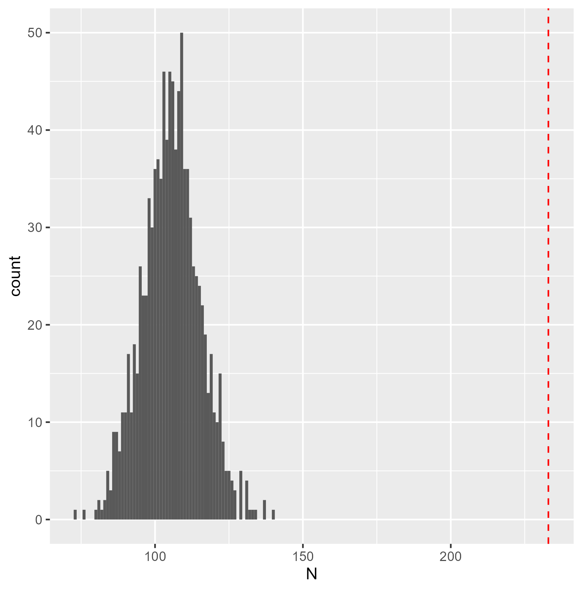
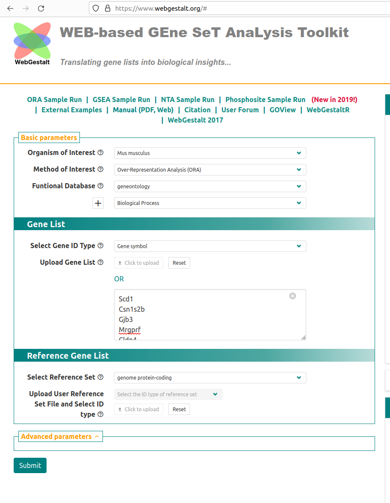
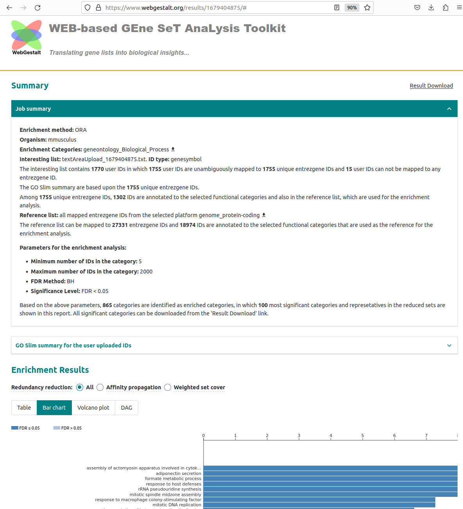
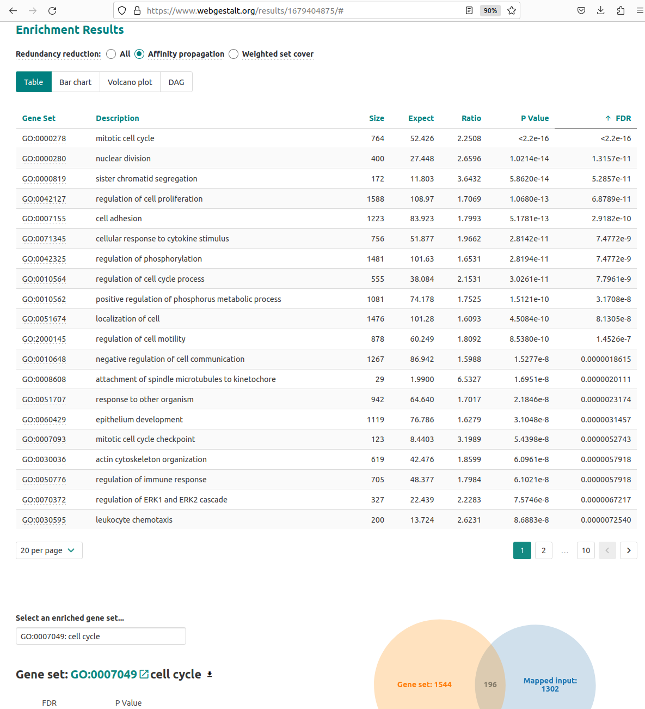
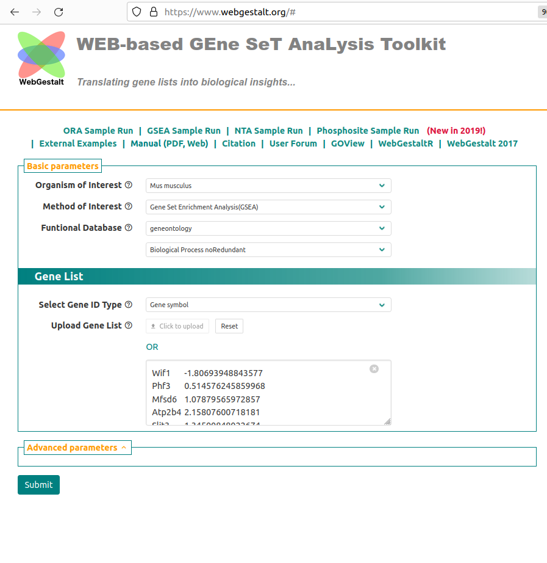
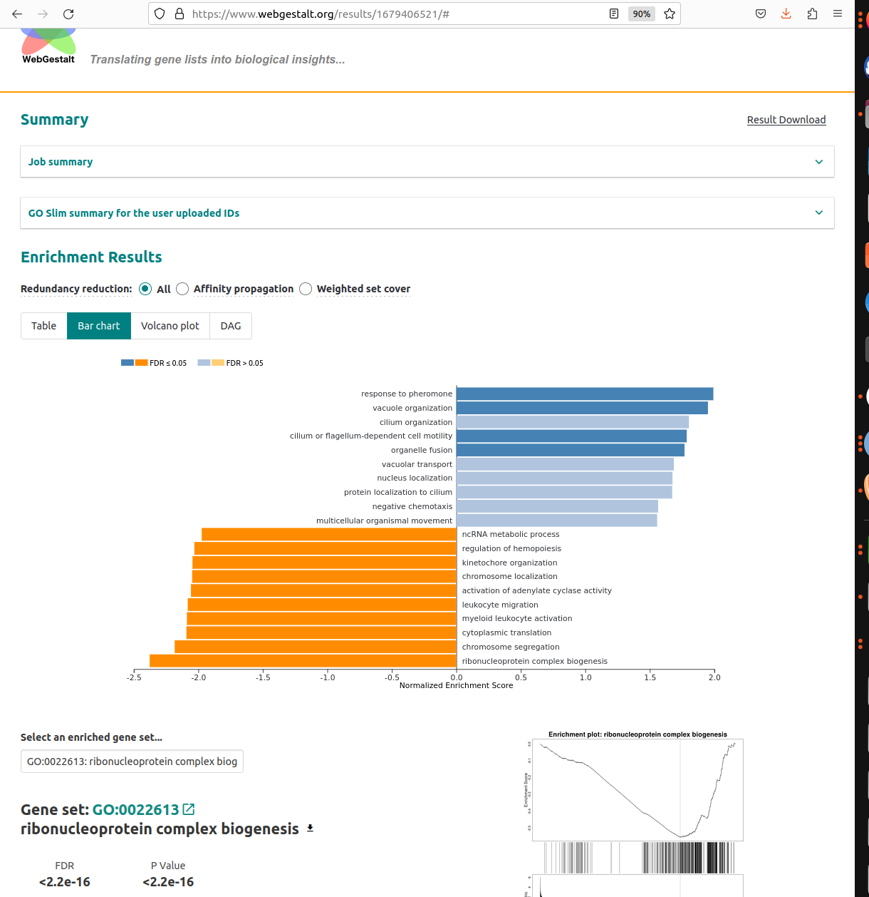

```{r setup, include=FALSE}
knitr::opts_chunk$set(echo = FALSE)
```


```{r echo=FALSE,message=FALSE}
library(limma)
```

# Recap

In this section we will use the following files

- [`background.csv`](background.csv) containing one row for each gene in the comparison Basal.pregnant vs Basal.lactation (27,179 rows).
- [`B.preg_vs_lactation.csv`](B.preg_vs_lactation.csv) containing one row for each found to be DE in the contrast Basal.pregnant vs Basal.Lactation.

It will be helpful to have both these files open in Excel.

# Enrichment and Pathways Analysis

The differential expression step is concerned with being able to say with confidence whether an individual gene has a different level of expression between biological groups. However, in this section we move towards discovering if our results are ***biologically significant***. Are the genes that we have picked statistical flukes, or are there some commonalities?

It can be informative to scan (manually) through the gene lists we generate through Degust and use our Biological intuition to look for themes. We might also look for previously-published genes, or genes that we have intentionally-manipulated (e.g. by knocking-out that gene). However, sometimes we can mislead ourselves into thinking our results are more significant than they really are.

In order to infer biological significance from our data, we need some way of being able to group genes together based on their function. The two main sources of these are:-


- [Gene Ontology](http://geneontology.org/)
- [KEGG](https://www.genome.jp/kegg/kegg1a.html)


The GO database defines the relationships between sets of genes in a tree-like structure starting with the most-general biological definition to increasingly specific cases.


The ontologies are split into three categories

- (**MF**) Molecular Function: the molecular activities of individual gene products
- (**CC**) Cellular Component: where the gene products are active
- (**BP**) Biological Process: the pathways and larger processes to which that gene product’s activity contributes

The KEGG database also defines sets of genes. There is no defined relationship between KEGG pathways. There is however a complex network between genes belonging to the same pathway which does not exist in GO.

- [e.g. Pathways in cancer](https://www.genome.jp/kegg-bin/show_pathway?hsa05200)

The choice of database does not actually affect how the statistical testing works. We test of significant collections regardless of how the collections have been defined.


The "cell cycle process" Gene Ontology has many hundreds of genes belonging to it. If we were to pick a set of genes **at random** of equivalent size as our list of differentially-expressed genes **we should not be surprised** to see a lot of cell-cycle genes appearing in the list. This is just due to the fact that we had a lot of possible cell-cycle genes to choose from. The key question is whether the number of cell-cycle (or any other pathway) is *more than we would expect by chance*.


In this section we will use the following files

-   [`background.csv`](background.csv) containing one row for each gene in the comparison Basal.pregnant vs Basal.lactation (27,179 rows).
-   [`B.preg_vs_lactation.csv`](B.preg_vs_lactation.csv) containing one row for each found to be DE in the contrast Basal.pregnant vs Basal.Lactation.

It will be helpful to have both these files open in Excel.


There are two different approaches one might use, and we will cover the theory behind both. The distinction is whether you are happy to use a hard (and arbitrary) threshold to identify DE genes.

## Over-representation analysis (ORA)

"Threshold-based" methods require definition of a statistical threshold to define list of genes to test (e.g. FDR \< 0.01). Then a *hypergeometric* test or *Fisher's Exact* test is generally used. These methods require plenty of DE genes as an input, so people often use more-relaxed criteria for identifying DE genes (e.g. raw rather than adjusted p-values or FDR value but in conjuction with a fold-change cut-off)

The question we are asking here is;

> ***"Are the number of DE genes associated with Gene Set X significantly greater than what we might expect by chance alone?"***

We can answer this question by knowing

-   the total number of DE genes
-   the number of genes in the gene set (pathway or process)
-   the number of genes in the gene set that are found to be DE
-   the total number of tested genes (background)

You will never need to know this, but for those interested  the formula for Fishers exact test is;

$$ p = \frac{\binom{a + b}{a}\binom{c +d}{c}}{\binom{n}{a +c}} = \frac{(a+b)!(c+d)!(a+c)!(b+d)!}{a!b!c!d!n!} $$

with:-

| **Differentially Expressed** | **Not Differentially Expressed** | **Total** |                        |
|:----------------:|:----------------:|:----------------:|:----------------:|
|         In Gene Set          |                a                 |     b     |         a + b          |
|       Not in Gene Set        |                c                 |     d     |         c + d          |
|          **Total**           |            **a + c**             | **b +d**  | **a + b + c + d (=n)** |


As a worked example, consider a Gene Set with **634** genes. After performing differential expression, we find that our list of differentially-expressed genes comprises **4595** genes. Amongst this gene list, **233** belong to our Gene Set. Plugging-in the numbers we get:-


|                 | Differentially Expressed | Not Differentially Expressed |
|-----------------|--------------------------|------------------------------|
| In Gene Set     | 233                      | 388                          |
| Not in Gene Set | 4362                     | 22196                        |


Which yields a **significant p-value** with a Fishers' test.

Another way of thinking about this is to *randomly* pick a set of **4595** genes (i.e. without using a p-value cut-off) and see how many belong to our gene set.


The first time we do this, we get **100** genes in our set. The second time we get **112** and so on...

If we repeat enough time we can make a histogram:-



We see that a value of 233 is extremely unlikely. In other words, using our p-value cut-off to generate our gene list has resulted in about **twice as many of our gene set than we would expect by chance**

- [R script for those that are interested...](sample_geneset.R)

## Using WebGestalt for ORA

<div class="information">
**N.B.** Previous version of this course used the website GOrilla for this section. However, at the time of writing this site no longer seems to be working. We have switched to using WebGestalt which can perform the same statistical tests as GOrilla and has a nicer interface.
</div>

There are several popular online tools for performing enrichment analysis We will be using the online tool [WebGestalt](https://www.webgestalt.org/) to perform the pathways analysis. It supports various types of analyses; the first of which accepts a list of pre-selected genes to perform an *ORA*.

1.  Go to <https://www.webgestalt.org/#>
2.  Choose the **ORA Sample Run** Tab



3.  Choose Organism: `Mus Musculus`
4.  Make sure that **Method of interest** is set to `Over-Representation Analysis (ORA)`
5.  Select **Functional Database** `geneontology` and `Biological Process non-redundant`
  + you can change this later if you wish
6.  Keep **Select Gene ID Type** as `Gene symbol`
7.  Paste the gene symbols corresponding to DE genes in *Basal pregnant vs Basal Lactation* from your Excel spreadsheet into the Upload Gene List box.

-   **The shortcut CTRL + SPACE will let you select an entire column**
- Do not paste the column heading `SYMBOL`
8. In **Select Reference Set** make sure *genome protein-coding* is selected.
9. Under **Advanced Parameters**, make sure that the *FDR* option is selected as Significance otherwise you will only get the top 10 pathways reported.
10. Click Submit


The page that appears can give a summary of the analysis performed (i.e. the number of genes that were used as input and how many names were recognised as valid gene names) along with various visualisations. The summary tab can be useful to check that you have supplied the correct kind of IDs (e.g. Gene symbol vs Ensembl, Entrez) and selected the correct organism. If few IDs are reported as being mapped, you should check your settings.

The *bar plot* shows the amount of enrichment for the pathways identified as being significant. A larger enrichment score indicates for a pathway indicates that genes are found in the list of gene names **more than you would expect by chance**. However, the pathways with the largest enrichment are not necessarily the most significant.



The table output shows details of the most over-represented pathways. Clicking on a pathway name in the left-hand column gives more information on the genes belonging to that pathway - including the names of genes in that pathway that were found in the list of genes. The **Expect** and **Ratio** columns indicate how many genes in a pathway that are *expected* to be found in the uploaded gene list, and how many more times genes in the pathway *actually occur* in the gene list. All columns in the table can be sorted.




::: exercise
**Exercise:** Use WebGestalt to find enriched pathways in the Basal pregnant vs lactation analysis and take some time to understand the results.
:::


## Threshold-free analysis

This type of analysis is popular for datasets where differential expression analysis does not reveal many genes that are differentially-expressed on their own. Instead, it seeks to identify genes that as a group have a tendency to be near the extremes of the log-fold changes. The results are typically presented in the following way.


The "barcode"-like panel represents where genes from a particular pathway (**HALLMARK_E2F_TARGETS** in this case) are located in a gene list *ranked* from most up-regulated to most down-regulated. The peak in the green curve is used to indicate where the majority of genes are located. If this is shifted to the left or the right it indicates that genes belonging to this gene set have a tendency to be up- or down-regulated. The set of genes for a given pathway that contribute most to the enrichment are called the **leading edge**.

One reason for the popularity of this method is that it does not rely on having to impose arbitrary cut-offs on the data. Instead, we need to provide a measure of the importance of each gene such as it's fold-change. These are then used the rank the genes.

The Broad institute has made this analysis method popular and provides [a version of GSEA](http://software.broadinstitute.org/gsea/index.jsp) that can be run via a java application. However, the application can be a bit fiddly to run, so we will use the Webgestalt website again

<https://www.webgestalt.org/#>

-   Open the file `background.csv` in Excel and delete all columns except the `SYMBOL` and `basal.lactation` column. 
-   Go to the Webgestalt website, and select **GSEA Sample Run** from the front page
-   Check that **Organism of interest** is `Mus musculus`
-   Make sure **Method of interest** is set to `Gene Set Enrichment Analysis (GSEA)`
-  Select **Functional Database** as `geneontology`
    + feel free to try other databases if you have time
-  Make sure that **Select Gene ID Type** is `Gene symbol` 
-   Paste the contents of your modified excel file into the text box under **Upload Gene List**. 
<div class ="information">
Do not paste the header line of **SYMBOL** and **basal.lactation** into the box
</div>
-   Click **Submit**

<div class="information">
If the GSEA analysis is taking too long, you might be able to spend up the process by choosing KEGG pathways as the database of choice and / or decreasing the number of permutations in the Advanced Parameters tab
</div>

The results are presented in a similar way to the ORA from the previous section. However, the enrichment scores presented can either be positive or negative - indicating that genes from a given pathway tend to up- or down-regulated. Selecting a pathway from the Table of results or bar chart will given information about the enrichment of the pathway and the *leading genes* (set of genes in the pathway responsible for the enrichment).





::: exercise
**Exercise:** Use Webgestalt to identify enriched pathways in the Basal Pregnant vs Lactation contrast. Compare the results from the most extreme positive and negative enrichment score, and make sure that you can interpret corresponding the barcode plots.
:::

If the GSEA analysis is taking too long, please use this link to view some results from the same dataset

- [Pre-generated GSEA results](https://www.webgestalt.org/results/1707054123/#)

# Alternative web-sites

The performance of WebGestalt can be a bit variable. Here are a couple of suggestions for alternative websites that work in a similar fashion and require the same data input

- [ShinyGO](http://bioinformatics.sdstate.edu/go/), for **Over-representation analysis** only
- [GeneTrail](https://genetrail.bioinf.uni-sb.de/index?pipeline=gene), for both Over-representation Analysis or GSEA depending on type of input data

