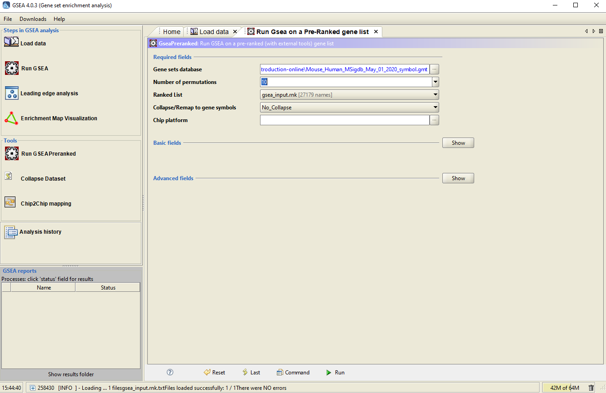
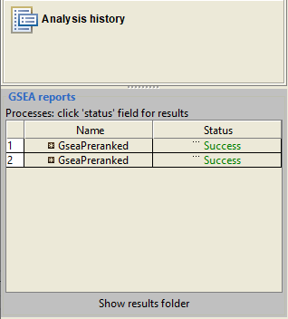
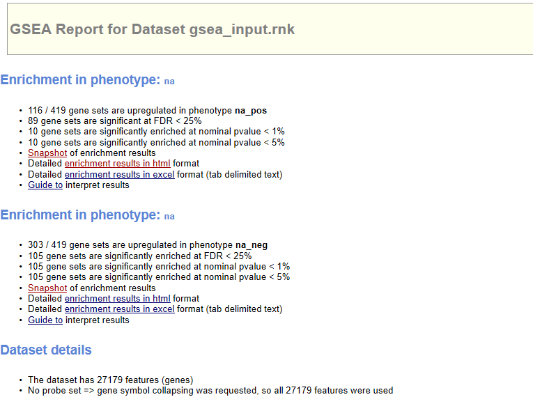

```{r setup, include=FALSE}
knitr::opts_chunk$set(echo = FALSE)
```


```{r echo=FALSE,message=FALSE}
library(limma)
```

# Recap

In this section we will use the following files

- [`background.csv`](background.csv) containing one row for each gene in the comparison Basal.pregnant vs Basal.lactation (27,179 rows).
- [`B.preg_vs_lactation.csv`](B.preg_vs_lactation.csv) containing one row for each found to be DE in the contrast Basal.pregnant vs Basal.Lactation.

It will be helpful to have both these files open in Excel.

# Gene-Ontologies and Annotation


In the early days of microarray analysis, people were happy if they got a handful of differentially-expressed genes that they could validate or follow-up. However, with later technologies (and depending on the experimental setup) we might have thousands of statistically-significant results, which no-one has the time to follow-up. Also, we might be interested in pathways / mechanisms that are altered and not just individual genes.

In this section we move towards discovering if our results are ***biologically significant***. Are the genes that we have picked statistical flukes, or are there some commonalities. 

There are two different approaches one might use, and we will cover the theory behind both. The distinction is whether you are happy to use a hard (and arbitrary) threshold to identify DE genes.


## Over-representation analysis

"Threshold-based" methods require defintion of a statistical threshold to define list of genes to test (e.g. FDR < 0.01). Then a *hypergeometric* test or *Fisher's Exact* test generally used. They are typically used in situations where plenty of DE genes have been identified, and people often use quite relaxed criteria for identifying DE genes (e.g. raw rather than adjusted p-values or FDR value)

The question we are asking here is;

> ***"Are the number of DE genes associated with Theme X significantly greater than what we might expect by chance alone?"***

We can answer this question by knowing

- the total number of DE genes
- the number of genes in the gene set (pathway or process)
- the number of genes in the gene set that are found to be DE
- the total number of tested genes (background)

The formula for Fishers exact test is;

$$ p = \frac{\binom{a + b}{a}\binom{c +d}{c}}{\binom{n}{a +c}} = \frac{(a+b)!(c+d)!(a+c)!(b+d)!}{a!b!c!d!n!} $$

with:-

```{r echo=FALSE}
df <- data.frame(`In DE List`  = c("a","c","a+c"), `Not in DE list` = c("b","d","b+d"), RowTotal = c("a +b","c+d","a+b+c+d (=n)"))
rownames(df) <- c("In Gene Set", "Not in Gene Set","Column Total")
df
```

In this first test, our genes will be grouped together according to their Gene Ontology (GO) terms:- http://www.geneontology.org/


## Using GOrilla

There are several popular online tools for performing enrichment analysis

We will be using the online tool [GOrilla](http://cbl-gorilla.cs.technion.ac.il/) to perform the pathways analysis. It has two modes; the first of which accepts a list of *background* and *target* genes. 

<div class="alert alert-warning">
**Question:**
Use GOrilla to find enriched pathways in the Basal pregnant vs lactation analysis
</div>

1. Go to http://cbl-gorilla.cs.technion.ac.il/
2. Read the “Running Example”


3. Choose Organism: `Mus Musculus`
4. Choose running mode: `Two unranked lists of genes`
5. Paste the gene symbols corresponding to DE genes in *Basal pregant vs Basal Lactation* into the Target set.
  + **The shortcut CTRL + SPACE will let you select an entire column**
6. Paste the gene symbols from the Background set into the other box.
7. Choose an Ontology: `Process`
8. `Search Enriched GO terms`

You should be presented with a graph of enriched GO terms showing the relationship between the terms. Each GO term is coloured according to its statistical significance.

Below the figure is the results table. This links to more information about each GO term, and lists each gene in the category that was found in your list. The enrichment column gives 4 numbers that are used to determine enrichment (similar to the Fisher exact test we saw earlier)

- N, total number of genes (should be the same in all rows)
- B, total number of genes annotated with the GO term
- n, total number of genes that were found in the list you uploaded (same for all rows)
- b, number of genes in the list you uploaded that intersect with this GO term

If you have time, you can also experiment uploading the same genes lists to the online tools [DAVID](https://david.ncifcrf.gov/tools.jsp) and [GeneTrail](https://genetrail2.bioinf.uni-sb.de/)


## Threshold-free analysis

This type of analyis is popular for datasets where differential expression analysis does not reveal many genes that are differentially-expressed on their own. Instead, it seeks to identify genes that as a group have a tendancy to be near the extremes of the log-fold changes.

The Broad institute has made this analyis method popular and provides [a version of GSEA](http://software.broadinstitute.org/gsea/index.jsp) that can be run via a java application. 


### Preparing the data


- Open the file `background.csv` in Excel
- Sort the spreadsheet by the third column (change relative to Basal Pregnant)
- Remove all columns apart from 1 and 3.
- Save as a new *tab-delimited* file and name it `gsea_input.rnk`.(Excel might also add a .txt extension, but it should still work)
- Download a set of pathway definitions for mouse in gmt format. e.g. [Mouse_Human_MSigdb_October_01_2020_symbol.gmt](http://download.baderlab.org/EM_Genesets/current_release/Mouse/symbol/Pathways/Mouse_Human_MSigdb_October_01_2020_symbol.gmt) 
  + other pathways (including pathways for other organisms) can be downloaded from http://baderlab.org/GeneSets


## Run the GSEAPreranked tool

You should have already downloaded the GSEA app

- Load the `gsea_input` file you have just created into the tool by clicking the *Load data* button. If you have problems loading the data, here is a pre-prepared on [here](gsea_input.rnk.txt).

- Load the `.gmt` file that you downloaded from baderlab.org

- Select the *GSEAPreranked* option from tools. You will need to choose what set of genes to use in the analysis. There are many curated *Human* gene sets available through the app. However, from http://baderlab.org/GeneSets we can download gene sets for other organisms. You can select the gmt file that you just loaded by clicking the *Gene matrix (local gmx/gmt)* tab.

- To reduce the running time, you can reduce the *Number of Permutations* option to 1 or 10. 

- Make sure the *Collapse/Remap* to gene symbols drop-down is set to **No_Collapse**

- Make sure your ranked gene list (`gsea_input.rnk`) appears in the *Ranked List* tab.



Click the Run icon at the bottom of the screen
The bottom-left panel of the GSEA screen should show the progress of the tool as it runs. Once **success** is displayed in green, you will be able to view the results 
these should be stored in your home directory, or via the Analysis History button on the left of the main screen



The results can be navigated in a web browser



